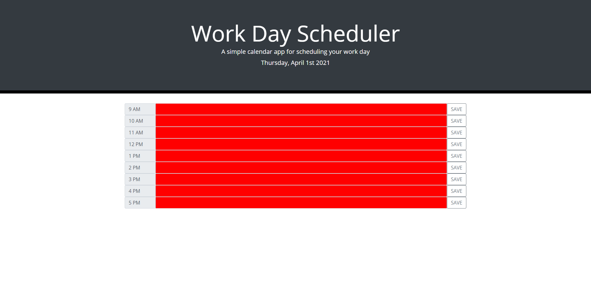

## Project link

Click [here] (https://hakkelo89.github.io/Day-Planner/) to view project on GitHub page.

# Day Planner

Create a simple calendar application that allows the user to save events for each hour of the day. This app will run in the browser and feature dynamically updated HTML and CSS powered by jQuery.

The app should display standard business hours (9 a.m. to 5 p.m.). Each time slot should represent one hour and contain the following:

- The time

- A field to hold user input

- A save button

Clicking on the save button will store the time and user input in `localStorage`.

Near the top of the calendar, the application should display the current day. Additionally, each hour should be color coded to reflect whether the time slot is in the past, the present, or the future. This will change depending on the time of day.

## User Story

```md
AS AN employee with a busy schedule
I WANT to add important events to a daily planner
SO THAT I can manage my time effectively
```

## Business Context

Poor time management can result in missed meetings and deadlines or create the appearance of unprofessionalism. A daily planner allows employees to see their day at a glance, schedule time effectively, and improve productivity.

## Minimum Requirements

This homework is graded based on the following criteria:

### Technical Acceptance Criteria: 40%

- Satisfies all of the above acceptance criteria plus the following:

  - Uses a date utility library to work with date and time

### Deployment: 32%

- Application deployed at live URL

- Application loads with no errors

- Application GitHub URL submitted

- GitHub repo contains application code

### Application Quality: 15%

- Application user experience is intuitive and easy to navigate

- Application user interface style is clean and polished

- Application resembles the mock-up functionality provided in the homework instructions

### Repository Quality: 13%

- Repository has a unique name

- Repository follows best practices for file structure and naming conventions

- Repository follows best practices for class/id naming conventions, indentation, quality comments, etc.

- Repository contains multiple descriptive commit messages

- Repository contains quality README file with description, screenshot, and link to deployed application

## Review

You are required to submit the following for review:

- The URL of the deployed application

- The URL of the GitHub repository, with a unique name and a README describing the project

---

## Screenshots


